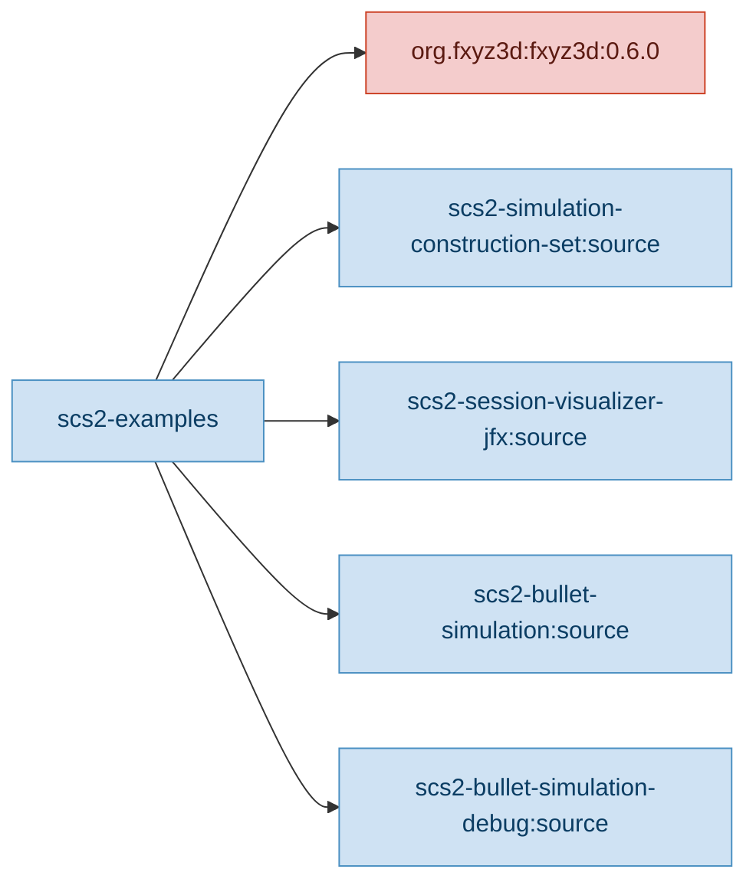
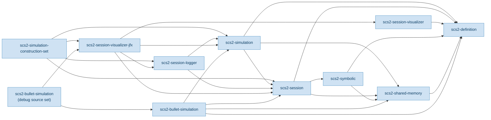
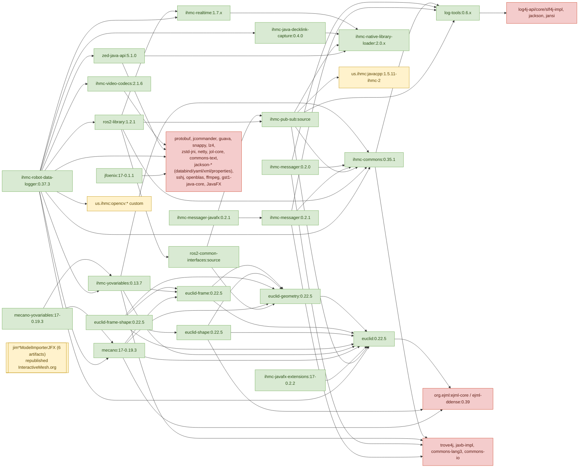

# scs2-examples Dependency Tree

This document analyzes the dependency tree for `scs2-examples`, starting from
`scs2-examples/build.gradle.kts` `mainDependencies`. Only `us.ihmc:*` dependencies
are traversed recursively. All other dependencies are shown as leaves.

A flat indented form is provided in [`DEPENDENCY.txt`](DEPENDENCY.txt).

## Legend

- **Local** module: build file lives in this workspace (`*/build.gradle.kts`).
- **GitHub** module: build file fetched from the corresponding tag on
  `github.com/ihmcrobotics/<repo>`.
- **External**: not under `us.ihmc:*`; not traversed.
- **us.ihmc (no GitHub)**: published under `us.ihmc:*` but no source repository
  is available on `ihmcrobotics`; not traversed.
- For multi-source-set repos (`euclid`, `mecano`, `ihmc-yovariables`,
  `ihmc-messager`, `ihmc-ros2-library`, `JFoenix-Group`), the build file used is
  the one for the matching source set (e.g. `euclid-shape:0.22.5` →
  `euclid/shape/build.gradle.kts`). For `scs2-bullet-simulation-debug:source`,
  the `debug` source set of `scs2-bullet-simulation` is used.

## 1. Top-level: `scs2-examples` direct dependencies

## 2. Local SCS2 modules — internal graph

Edges show `mainDependencies` between the in-workspace SCS2 modules.

## 3. External `us.ihmc:*` libraries pulled in (from `ihmcrobotics` on GitHub)

This graph shows the published `us.ihmc:*` artifacts referenced (directly or
transitively) by the local SCS2 modules above, traversed through their GitHub
`build.gradle.kts` files. Non-`us.ihmc` transitive dependencies are summarized as
single nodes per library.

## 4. Notes

- `us.ihmc:scs2-definition:17-0.32.0` is referenced by `ihmc-robot-data-logger`
  as a published artifact. In this workspace it is not re-traversed because the
  same module is the local source-set node `scs2-definition`.
- `us.ihmc:javacpp:1.5.11-ihmc-2` and `us.ihmc:opencv:*-ihmc` are custom IHMC
  builds hosted on `robotlabfiles.ihmc.us`, not on `github.com/ihmcrobotics`,
  and are therefore not traversed.
- The six `us.ihmc:jim*ModelImporterJFX` artifacts are republications of the
  third-party InteractiveMesh.org JavaFX 3D model importers; no source
  repository exists under `ihmcrobotics`, so they are leaves.
